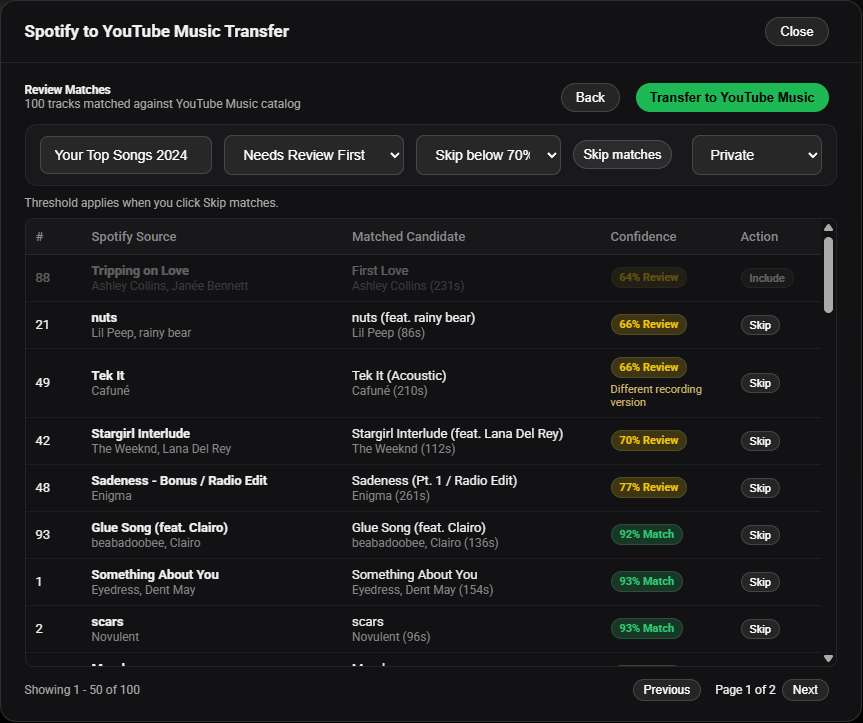
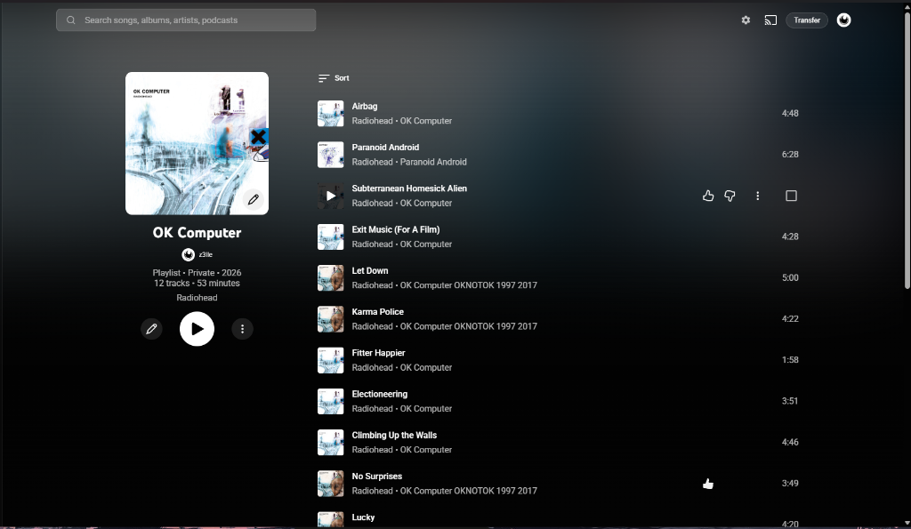
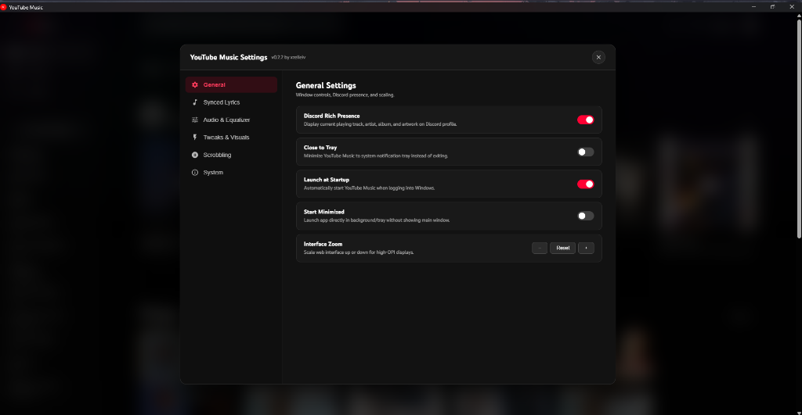
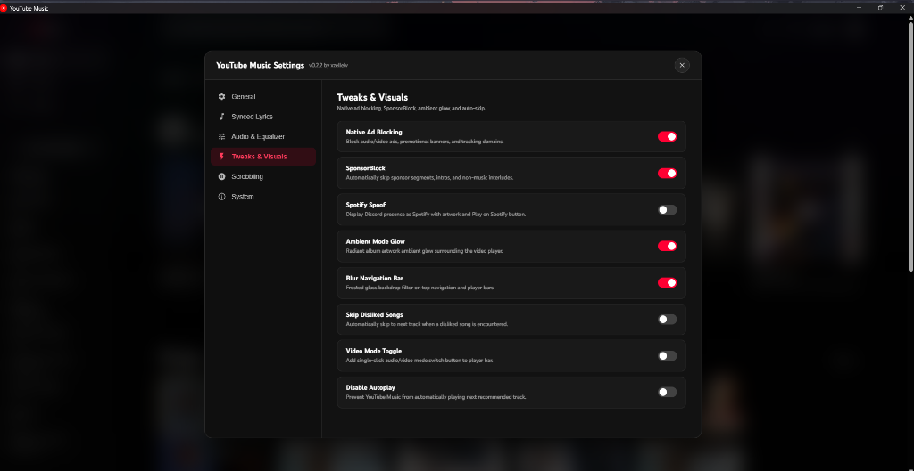

# YouTube Music Unofficial

[](https://github.com/xzelleiv/ytm-tauri/releases/latest)
[](#requirements)
[](https://tauri.app/)
[](LICENSE)

Unofficial Windows desktop app for YouTube Music, built with Tauri v2 and WebView2.

This app gives YouTube Music its own dedicated Windows window, keeps your normal YouTube account session, filters common ad/tracking requests, and publishes the current track to Discord Rich Presence.

## Status

- Windows only.
- Unofficial project, not affiliated with YouTube, Google, Discord, Microsoft, or Tauri.
- Current release: [`v0.2.3`](https://github.com/xzelleiv/ytm-tauri/releases/tag/v0.2.3).

## Download

Use the NSIS setup installer for normal installs:

[Download `YouTube.Music_0.2.3_x64-setup.exe`](https://github.com/xzelleiv/ytm-tauri/releases/download/v0.2.3/YouTube.Music_0.2.3_x64-setup.exe)

An MSI package is also available on the [release page](https://github.com/xzelleiv/ytm-tauri/releases/tag/v0.2.3).

> Windows may show an “Unknown publisher” notice because this community release is not code-signed.

## Features

- Dedicated Windows app window for YouTube Music.
- Built-in Spotify to YouTube Music playlist transfer (public links, Liked Songs, private playlists, and CSV/text import).
- Persistent Discord RPC and ad-block toggles with live status.
- Persistent YouTube login/session through the app WebView profile.
- Built-in ad blocking with native request filtering, blocked-request count, and page-side cleanup.
- System tray controls for show/hide, previous, play/pause, next, Discord RPC, and quit.
- Reload, zoom, cache clear, and session reset controls.
- Optional close-to-tray, launch at startup, and start minimized behavior.
- External links open in the default browser.
- Automatic and manual GitHub release checks.
- Left-hand global playback shortcuts.

YouTube Music's WebView profile retains login, volume, window state, and site preferences.

## Screenshots

<details open>
<summary>Spotify to YouTube Music Transfer</summary>
<br>
<p align="center">
  
</p>
<p align="center">
  
</p>
</details>

<details>
<summary>Settings & Customization</summary>
<br>
<p align="center">
  
</p>
<p align="center">
  
</p>
</details>

## Shortcuts

- `Ctrl+Alt+A`: previous track.
- `Ctrl+Alt+S`: play or pause.
- `Ctrl+Alt+D`: next track.
- `Ctrl+R`: reload.
- `Ctrl++`, `Ctrl+-`, `Ctrl+0`: zoom.
- `Ctrl+Shift+Delete`: reset the YouTube Music session.

## Requirements

- Windows 10 or newer.
- Microsoft Edge WebView2 Runtime.
- Discord desktop client for Rich Presence.

Windows may label WebView2 playback as `Unknown app` in system media controls.
This is an upstream WebView2/Tauri limitation; track metadata and media buttons still work.

<details>
<summary>Developer notes</summary>

### Local Build Requirements

- Node.js and npm.
- Rust toolchain with Cargo.
- Windows WebView2 Runtime.

### Build From Source

```powershell
npm install
npm run build:unsigned
```

Build outputs are written under:

```powershell
src-tauri\target\release\bundle\
```

Unsigned builds are for local testing only. Release builds require an Authenticode
code-signing certificate installed in the current user's certificate store:

```powershell
$env:WINDOWS_CERTIFICATE_THUMBPRINT = "YOUR_40_CHARACTER_SHA1_THUMBPRINT"
$env:WINDOWS_TIMESTAMP_URL = "https://YOUR_CERTIFICATE_PROVIDER_TIMESTAMP_URL"
npm run build
```

The release build stops if signing is not configured or any generated EXE/MSI
fails Authenticode, MSI license, or embedded WebView2 verification.

After an unsigned local package build, run the same non-signature bundle checks:

```powershell
npm run verify:windows
```

If `cargo` is not recognized, install Rust from [rust-lang.org/tools/install](https://www.rust-lang.org/tools/install), restart PowerShell, then rerun the build.

### Discord Rich Presence

Discord Rich Presence is configured from the bundled `src-tauri/discord-client-id.txt`.

Advanced override:

```powershell
$env:YT_MUSIC_DISCORD_CLIENT_ID = "your_discord_application_id"
npm run dev
```

### Ad Block Self-Test

The app has a hidden self-test mode for the native request blocker:

```powershell
$env:YT_MUSIC_ADBLOCK_SELF_TEST = "1"
Start-Process "$env:LOCALAPPDATA\YouTube Music\yt-music-tauri.exe"
```

When the blocker is wired correctly, the window title briefly becomes `ADBLOCK_SELF_TEST:PASS`.

### Spotify Library Sign-In

The Spotify transfer dialog can read Liked Songs and private playlists through either:

- A dedicated incognito WebView2 sign-in window. The native host reads the HttpOnly `sp_dc` cookie and immediately closes the temporary auth windows.
- Browser OAuth with PKCE. Register `http://127.0.0.1/callback` as a loopback redirect URI in the Spotify developer dashboard, then provide the public client ID when building or launching the app:

```powershell
$env:YTM_SPOTIFY_CLIENT_ID = "your_public_spotify_client_id"
npm run dev
```

No Spotify client secret is embedded in the desktop app. If a client ID is not configured, the browser button opens a localhost-only helper for manually submitting a web access token or `sp_dc` value. Stored Spotify credentials are encrypted for the current Windows user with DPAPI.

### Security Notes

- The remote YouTube Music page receives no Tauri permissions.
- Rich Presence metadata is sent through a document-title bridge instead of exposing app IPC to the remote page.
- Navigation is restricted to YouTube Music and expected Google/YouTube sign-in hosts.
- Spotify authentication windows allow HTTPS Spotify origins only and expose no Tauri IPC.
- External HTTPS links leave the app and open in the default browser.
- Rich Presence buttons and artwork are limited to trusted YouTube, `ytimg.com`, and Googleusercontent hosts.

### Contributor Guide

- `src-tauri/src/lib.rs` builds the Tauri window and gates navigation/title messages.
- `src-tauri/src/controls.rs` owns menus, tray actions, shortcuts, and recovery actions.
- `src-tauri/src/settings.rs` persists native app preferences.
- `src-tauri/src/url_policy.rs` owns URL allow-lists for navigation and Discord Rich Presence.
- `src-tauri/src/presence.rs` formats Discord Rich Presence data.
- `src-tauri/src/track_probe.js` reads YouTube Music track state from the page.
- `src-tauri/src/adblock.rs` contains native WebView2 request-blocking rules.
- `src-tauri/src/adblock_probe.js` handles page-side ad skip and cleanup behavior.
- `src-tauri/src/spotify/` contains Spotify client APIs, TOTP token exchange, DPAPI session storage, and PKCE auth.
- `src-tauri/src/transfer/` contains playlist matcher and parser engines.

Add or update unit tests when changing URL policy, ad URL rules, or security-sensitive bridge behavior.

</details>

## Credits

- [xzelleiv](https://github.com/xzelleiv)
- [Henix](https://github.com/justhenix) (original creator of [`yt-music-unofficial`](https://github.com/justhenix/yt-music-unofficial))
- [Pear Desktop](https://github.com/pear-devs/pear-desktop)

## License

MIT. See [LICENSE](LICENSE).

Third-party dependency acknowledgements are listed in [THIRD_PARTY_NOTICES.md](THIRD_PARTY_NOTICES.md).
