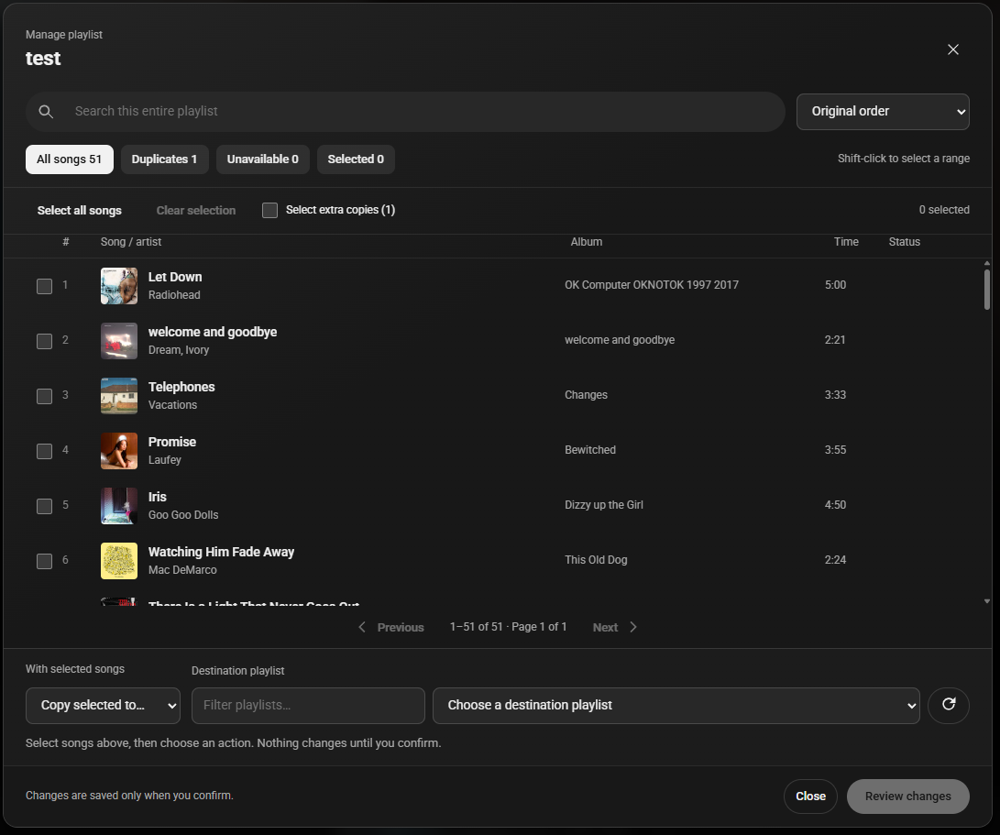
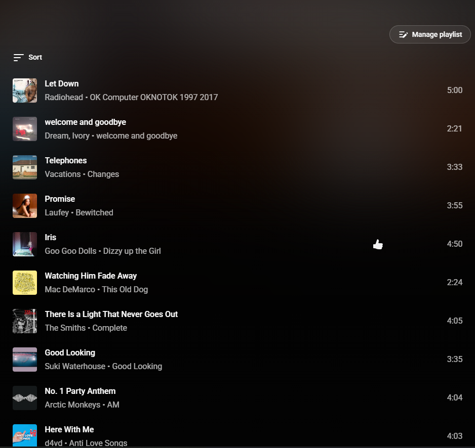
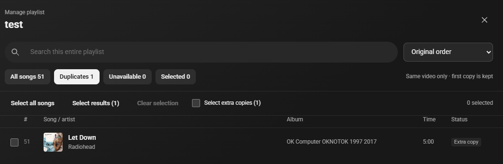
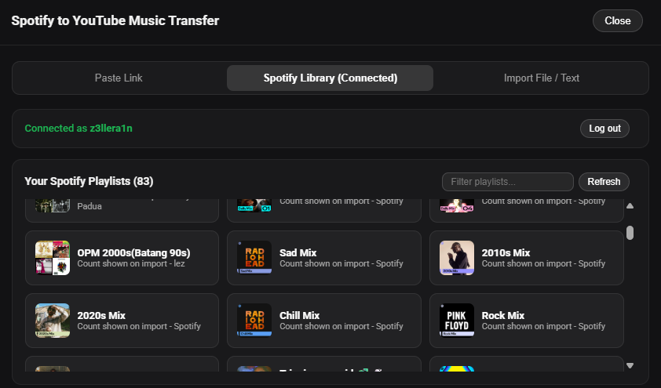
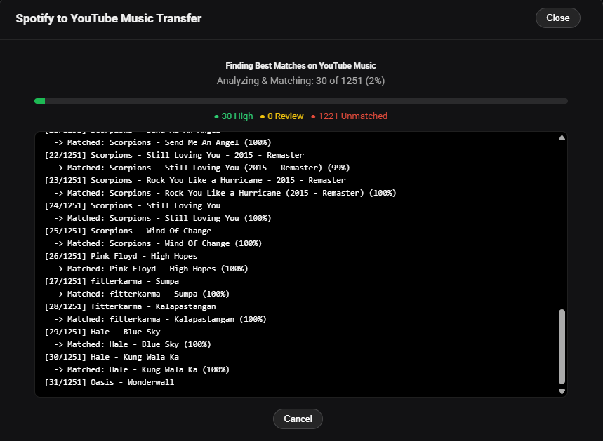

# YouTube Music Unofficial

[](https://github.com/xzelleiv/ytm-tauri/releases/latest)
[](#requirements)
[](https://tauri.app/)
[](LICENSE)

Unofficial Windows desktop app for YouTube Music, built with Tauri v2 and WebView2.

This app gives YouTube Music its own dedicated Windows window, keeps your normal YouTube account session, filters common ad/tracking requests, and publishes the current track to Discord Rich Presence.

## Status

- Windows only.
- Unofficial project, not affiliated with YouTube, Google, Discord, Microsoft, or Tauri.
- Current release: [`v0.2.5`](https://github.com/xzelleiv/ytm-tauri/releases/tag/v0.2.5).

## Download

Use the NSIS setup installer for normal installs:

[Download `YouTube.Music_0.2.5_x64-setup.exe`](https://github.com/xzelleiv/ytm-tauri/releases/download/v0.2.5/YouTube.Music_0.2.5_x64-setup.exe)

An MSI package is also available on the [release page](https://github.com/xzelleiv/ytm-tauri/releases/tag/v0.2.5).

> Windows may show an “Unknown publisher” notice because this community release is not code-signed.

## Features

- Dedicated Windows app window for YouTube Music.
- Built-in Spotify to YouTube Music playlist transfer (public links, Liked Songs, private playlists, and CSV/text import).
- Playlist manager with full-playlist search, focused review filters, range selection, saved sorting, precise song positioning, and bulk copy, move, or removal.
- Persistent Discord RPC and ad-block toggles with live status.
- Persistent YouTube login/session through the app WebView profile.
- Built-in ad blocking with native request filtering, blocked-request count, and page-side cleanup.
- System tray controls for show/hide, previous, play/pause, next, Discord RPC, and quit.
- Reload, zoom, cache clear, and session reset controls.
- Optional close-to-tray, launch at startup, and start minimized behavior.
- External links open in the default browser.
- Automatic and manual update checks, with download progress in Settings and signature verification before installation.
- Left-hand global playback shortcuts.

YouTube Music's WebView profile retains login, volume, window state, and site preferences.

## Screenshots

<details open>
<summary>Playlist manager · organize, copy, and clean up</summary>
<br>
<p align="center">
  
</p>
<p align="center"><em>Search the entire playlist, review extra copies, and choose where selected songs go.</em></p>
<p align="center">
  
  <br><em>Open the manager directly from the playlist page.</em>
</p>
<p align="center">
  
  <br><em>Review extra copies without selecting the original entry.</em>
</p>
</details>

<details open>
<summary>Spotify to YouTube Music Transfer</summary>
<br>
<p align="center">
  
  <br><em>Your connected Spotify account and playlist library, available inside the app.</em>
</p>
<p align="center">
  
  <br><em>Review match confidence and recording versions, then skip songs below your chosen threshold.</em>
</p>
<p align="center">
  
</p>
<p align="center">
  
</p>
</details>

<details>
<summary>Settings & Customization</summary>
<br>
<p align="center">
  
</p>
<p align="center">
  
</p>
</details>

## Shortcuts

- `Ctrl+H`: show keyboard shortcuts without leaving the player.
- `Ctrl+Alt+A`: previous track.
- `Ctrl+Alt+S`: play or pause.
- `Ctrl+Alt+D`: next track.
- `Ctrl+R`: reload.
- `Ctrl++`, `Ctrl+-`, `Ctrl+0`: zoom.
- `Ctrl+Shift+Delete`: reset the YouTube Music session.

## Requirements

- Windows 10 or newer.
- Microsoft Edge WebView2 Runtime.
- Discord desktop client for Rich Presence.

Windows may label WebView2 playback as `Unknown app` in system media controls.
This is an upstream WebView2/Tauri limitation; track metadata and media buttons still work.

<details>
<summary>Developer notes</summary>

### Local Build Requirements

- Node.js and npm.
- Rust toolchain with Cargo.
- Windows WebView2 Runtime.

### Build From Source

```powershell
npm install
npm run build:unsigned
```

Build outputs are written under:

```powershell
src-tauri\target\release\bundle\
```

Unsigned builds are for local testing only. Release builds require an Authenticode
code-signing certificate installed in the current user's certificate store:

```powershell
$env:WINDOWS_CERTIFICATE_THUMBPRINT = "YOUR_40_CHARACTER_SHA1_THUMBPRINT"
$env:WINDOWS_TIMESTAMP_URL = "https://YOUR_CERTIFICATE_PROVIDER_TIMESTAMP_URL"
npm run build
```

The release build stops if signing is not configured or any generated EXE/MSI
fails Authenticode, MSI license, or embedded WebView2 verification.

After an unsigned local package build, run the same non-signature bundle checks:

```powershell
npm run verify:windows
```

If `cargo` is not recognized, install Rust from [rust-lang.org/tools/install](https://www.rust-lang.org/tools/install), restart PowerShell, then rerun the build.

### Discord Rich Presence

Discord Rich Presence is configured from the bundled `src-tauri/discord-client-id.txt`.

Advanced override:

```powershell
$env:YT_MUSIC_DISCORD_CLIENT_ID = "your_discord_application_id"
npm run dev
```

### Ad Block Self-Test

The app has a hidden self-test mode for the native request blocker:

```powershell
$env:YT_MUSIC_ADBLOCK_SELF_TEST = "1"
Start-Process "$env:LOCALAPPDATA\YouTube Music\yt-music-tauri.exe"
```

When the blocker is wired correctly, the window title briefly becomes `ADBLOCK_SELF_TEST:PASS`.

### Spotify Library Sign-In

Open **Spotify Transfer → Spotify Library → Sign in with Spotify** to use the built-in login. After connecting, select **Liked Songs** or a playlist. Authenticated imports fetch successive pages, including libraries larger than 100 songs; public embed links can still return only a preview.

The dedicated incognito WebView2 window opens Spotify's own sign-in page. The native host reads its HttpOnly `sp_dc` cookie, stores the session encrypted for the current Windows user with DPAPI, and closes the temporary sign-in windows after accepting the session. No Spotify client ID, client secret, or manual cookie copying is required for this flow. Chrome's existing login is separate from the app's sign-in window.

The native backend also retains its optional browser OAuth/PKCE integration for developers configuring `YTM_SPOTIFY_CLIENT_ID`; the standard sign-in button uses the built-in window.

Cookie-based sessions read Spotify's Web Player library endpoints. These private endpoints and their persisted query hashes can change; unsupported responses produce an error rather than an apparently complete 100-song import. Spotify rate limits are reported with a cooldown before another request.

Matching uses a small pool of concurrent searches and reuses duplicate queries. Weak results receive a broader search; differing artist credits and alternate recordings remain available for review. In the review screen, **Auto Skip** offers 70%, 60%, 50%, or a custom threshold. Skipping a song preserves the current scroll position.

### Playlist Manager

Organize large playlists without endless scrolling. **Manage playlist** opens beside Sort, or above the song list on other layouts. Browse album artwork, search every song, and make reviewed bulk changes—including transfers to private playlists.

- **Find and select:** search titles, artists, or albums. Select all songs across every page, select filtered results, or Shift-click a range. Filters keep selections intact.
- **Clean up:** select extra copies of the same video while keeping the first, or review songs explicitly marked unavailable by YouTube Music.
- **Copy or move:** search your signed-in playlists by name. The preview reports how many selected songs already exist in the destination and skips them. No share link needed.
- **Arrange:** sort the view by title, artist, album, duration, or original order. Save the whole sort order, or move selected songs to a numbered position while preserving their relative order.
- **Review and confirm:** inspect counts and the destination before saving. Copies and removals use batches of up to 25. Moves remove source entries only after the destination batch succeeds; songs skipped as already present stay in the source.

Destination checks are reused while selecting songs and refreshed before saving. If the destination changed, review the revised counts again. Interrupted or unconfirmed batches stop without automatic retries; the interface reports the error and preserves unfinished selections for review. Song artwork comes from YouTube Music; custom playlist cover images are not transferred.

Screenshots show the app in use. Automated checks cover representative responses and simulated writes; they do not clean up user playlists.

### App updates

Open **Settings → System → App updates** to check for a new version. Downloads run inside the app after confirmation. The update card shows downloaded size and progress, then verification and installation status. Closing Settings does not interrupt the download. If an update fails, reopen this card to retry.

### Security Notes

- The remote YouTube Music page receives no Tauri permissions.
- Rich Presence metadata is sent through a document-title bridge instead of exposing app IPC to the remote page.
- Navigation is restricted to YouTube Music and expected Google/YouTube sign-in hosts.
- Spotify authentication windows allow HTTPS Spotify origins only and expose no Tauri IPC.
- External HTTPS links leave the app and open in the default browser.
- Rich Presence buttons and artwork are limited to trusted YouTube, `ytimg.com`, and Googleusercontent hosts.

### Contributor Guide

- `src-tauri/src/lib.rs` builds the Tauri window and gates navigation/title messages.
- `src-tauri/src/controls.rs` owns menus, tray actions, shortcuts, and recovery actions.
- `src-tauri/src/settings.rs` persists native app preferences.
- `src-tauri/src/url_policy.rs` owns URL allow-lists for navigation and Discord Rich Presence.
- `src-tauri/src/presence.rs` formats Discord Rich Presence data.
- `src-tauri/src/track_probe.js` reads YouTube Music track state from the page.
- `src-tauri/src/adblock.rs` contains native WebView2 request-blocking rules.
- `src-tauri/src/adblock_probe.js` handles page-side ad skip and cleanup behavior.
- `src-tauri/src/spotify/` contains Spotify client APIs, TOTP token exchange, DPAPI session storage, and PKCE auth.
- `src-tauri/src/transfer/` contains playlist matcher and parser engines.

Add or update unit tests when changing URL policy, ad URL rules, or security-sensitive bridge behavior.

</details>

## Credits

- [xzelleiv](https://github.com/xzelleiv)
- [Henix](https://github.com/justhenix) (original creator of [`yt-music-unofficial`](https://github.com/justhenix/yt-music-unofficial))
- [Pear Desktop](https://github.com/pear-devs/pear-desktop)

## License

MIT. See [LICENSE](LICENSE).

Third-party dependency acknowledgements are listed in [THIRD_PARTY_NOTICES.md](THIRD_PARTY_NOTICES.md).
